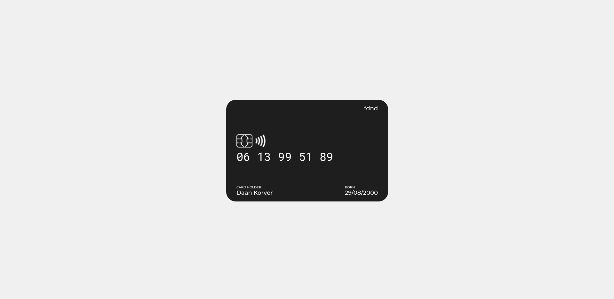

# 💳 Visitekaartje




<!-- Voeg een link toe naar Github Pages 🌐-->
Voor de introductie van fdnd kregen wij als klas de opdracht om allemaal individueel een visitekaartje te maken. Ik heb gekozen voor een soort van credit card design omdat ik het simpel wou houden maar ook netjes als een soort kaartje. 
[Live versie](http://www.daan.student.fdnd.nl)
<!-- Voeg een mooie poster visual toe 📸 -->

## Inhoudsopgave

- [Titel](#titel)
  * [Installatie](#installatie)
  * [Bronnen](#bronnen)
  * [Licentie](#licentie)

## Installatie
```
git clone https://github.com/DaanKorver/fdnd-visitekaartje-autonomous.git

cd fdnd-visite-kaartje-autonomous
```
## Bronnen
Het brein van Daan - Daan 2021

## Licentie


This work is licensed under [GNU GPLv3](./LICENSE).
